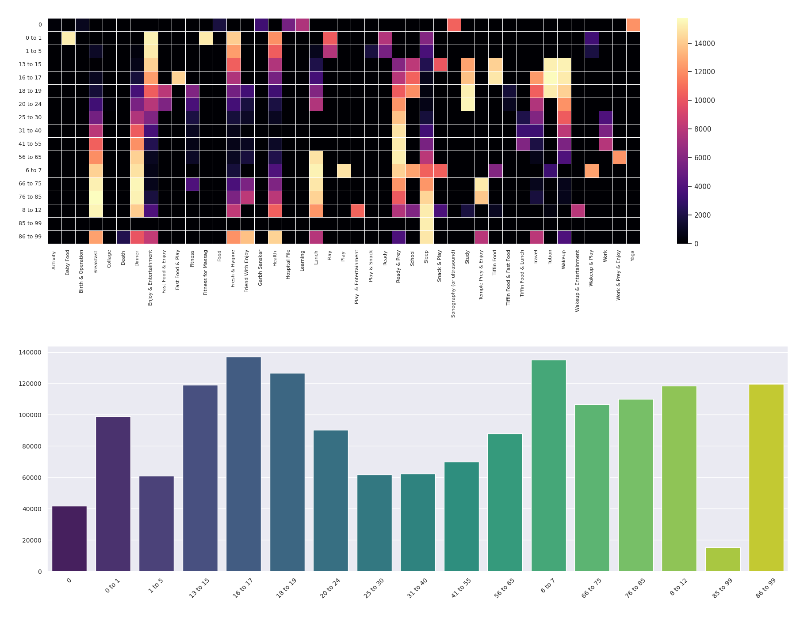

# 🌌 Google Willow & Cirq SCM Quantum Simulation Dashboard

An advanced quantum simulation and analytics framework leveraging **Google Willow architecture** and **Cirq** to model human timeline SCM (Supply Chain Management), global population distributions, age-wise routines, and industry superpositions.

---

## 📊 Visual Dashboards & Circuit Outputs

### 1. Google Willow / Cirq Quantum Circuit & State Outcomes

### 2. Age-wise Global Population Quantum Simulation

### 3. Age vs Routine Quantum Interaction Matrix

### 4. SCM Routine & Industry Superposition Analysis

### 5. Civilizational & Quantum Analytics Distribution

---

## 🚀 Key Features
* **Quantum Circuit Modeling:** Built using Cirq simulating Google Willow qubit architectures with parameterized rotation gates ($R_z$).
* **Demographic Mapping:** Integrates global population data across 16 core pipelines and age brackets.
* **Routine Entanglement Matrix:** Cross-analyzes human daily activities, age timelines, and industry sectors using thermal heatmaps and quantum measurement probabilities.
